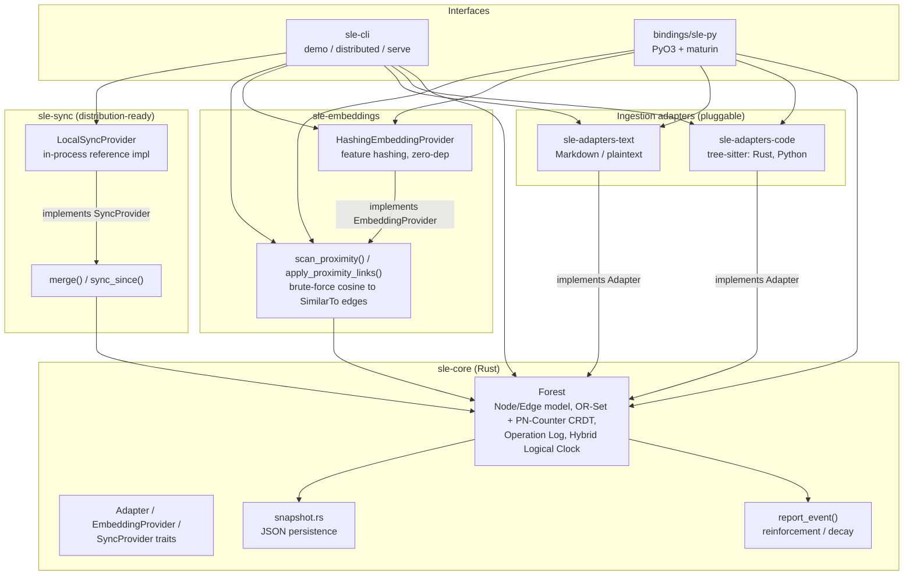
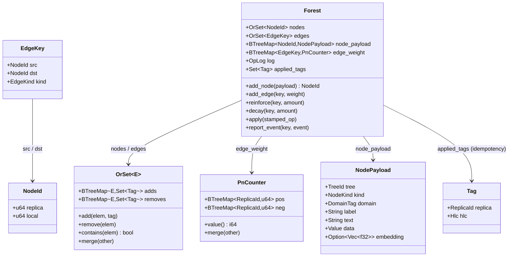

# Architecture

The engine is a Rust workspace of small, trait-bounded crates. `sle-core`
depends on nothing domain-specific — only on the `Adapter`,
`EmbeddingProvider`, and `SyncProvider` traits it defines — which is what
keeps the engine language-agnostic, platform-agnostic, and pluggable:
every language, embedding backend, or transport is a new implementation of
one of those traits, not a change to the core.

## System diagram

## Core data model

**Why this shape:** every mutation (`AddNode`, `AddEdge`, `Reinforce`,
`Decay`) is appended to `Forest`'s operation log with a `Tag` (replica +
hybrid-logical-clock timestamp). Node/edge *existence* is an add-wins
OR-Set; edge *weight* is a PN-Counter (each replica's increments/decrements
tracked separately, merged by per-replica max/sum). Both are commutative,
associative, and idempotent by construction, so two replicas can always
merge their operation logs — in any order, even with overlap — and
converge to the same state. That CRDT shape is what "distributed" means
for this engine in v1: a single process today, provably mergeable with
another process's history whenever a real network transport is added
behind `SyncProvider`.

## Crate/layer reference

| Layer | Crate | Role |
|---|---|---|
| Core | `sle-core` | Node/Edge/Forest CRDT model, operation log, HLC, reinforcement/decay, plugin traits, JSON snapshot persistence |
| Ingestion | `sle-adapters-code` | tree-sitter-based `Adapter` for Rust & Python: Module/Class/Function/Import nodes, Contains/Precedes/Calls/Imports edges |
| Ingestion | `sle-adapters-text` | Markdown/plaintext `Adapter`: Document/Section/Paragraph nodes, Contains/Precedes edges |
| Learning | `sle-embeddings` | `EmbeddingProvider` (hashing-trick), `scan_proximity`/`apply_proximity_links` (cross-tree `SimilarTo` edges) |
| Distribution | `sle-sync` | `SyncProvider`, `LocalSyncProvider`, `merge`/`sync_since`, proptest convergence tests |
| Interface | `sle-cli` | `demo`, `distributed`, `serve` (stdio JSON-line stub) |
| Interface | `bindings/sle-py` | PyO3/maturin `Engine` class — same traits/Forest, exposed to Python |

See [feature-map.md](feature-map.md) for how these map back to the original
requirements, and [request-workflow.md](request-workflow.md) for
sequence-level flows through each entry point.
