# Feature Map

Maps the original brainstorm requirements to what's actually implemented,
and where. Update this alongside `architecture.md` whenever a requirement
moves from "designed" to "implemented," or a new one is added.

```mermaid
graph TD
    Root["Self-Learning Semantic Engine"]

    Root --> Lang["Language & platform agnostic"]
    Lang --> Lang1["Adapter trait in sle-core"]
    Lang1 --> Lang1a["tree-sitter code adapter: Rust, Python"]
    Lang1 --> Lang1b["Markdown / plaintext adapter"]
    Lang1 --> Lang1c["new language = new grammar + mapping fn, no core change"]
    Lang --> Lang2["Consumption-side agnostic too"]
    Lang2 --> Lang2a["Rust core"]
    Lang2 --> Lang2b["PyO3 Python bindings"]
    Lang2 --> Lang2c["stdio JSON-line CLI serve stub"]

    Root --> Learn["Self-learning & self-updating"]
    Learn --> Learn1["report_event API"]
    Learn1 --> Learn1a["Accessed / EditedTogether"]
    Learn1 --> Learn1b["SuggestionAccepted / SuggestionRejected"]
    Learn1 --> Learn1c["TestPassed / TestFailed"]
    Learn --> Learn2["Reinforcement & decay via PN-Counter edge weights"]
    Learn --> Learn3["No re-parsing needed to update weights"]

    Root --> Tree["Semantic tree / forest of knowledge"]
    Tree --> Tree1["Node & Edge model"]
    Tree1 --> Tree1a["Contains, Precedes: structural"]
    Tree1 --> Tree1b["Calls, Imports: code adapter"]
    Tree1 --> Tree1c["SimilarTo: proximity scanner"]
    Tree --> Tree2["Forest = many trees in one replica"]

    Root --> Prox["Connects trees when in proximity"]
    Prox --> Prox1["HashingEmbeddingProvider: feature hashing, zero-dep"]
    Prox --> Prox2["scan_proximity: cosine similarity over embedded nodes"]
    Prox --> Prox3["apply_proximity_links: materializes SimilarTo edges"]
    Prox --> Prox4["Demonstrated cross-domain: code function to doc section"]
    Prox --> Prox5["Demonstrated discrimination: unrelated content stays unlinked"]

    Root --> Dist["Distributed & robust"]
    Dist --> Dist1["CRDT data model"]
    Dist1 --> Dist1a["OR-Set for node/edge existence: add-wins"]
    Dist1 --> Dist1b["PN-Counter for edge weight: per-replica sum"]
    Dist1 --> Dist1c["Hybrid Logical Clock for causal ordering"]
    Dist --> Dist2["SyncProvider trait"]
    Dist2 --> Dist2a["LocalSyncProvider: in-process reference impl"]
    Dist2 --> Dist2b["proptest-verified convergence: commutative, associative, idempotent"]
    Dist --> Dist3["Idempotent operation log: safe replay under overlapping sync"]
    Dist --> Dist4["JSON snapshot persistence: crash recovery"]

    Root --> Plug["Flexible, extendable, pluggable"]
    Plug --> Plug1["Adapter trait: swap/add ingestion domains"]
    Plug --> Plug2["EmbeddingProvider trait: swap hashing for a real ML model"]
    Plug --> Plug3["SyncProvider trait: swap loopback for a real network transport"]
    Plug --> Plug4["Proximity scan is brute-force behind a stable signature, swappable for a real ANN index such as HNSW"]

    Root --> Apps["Target applications"]
    Apps --> Apps1["AI coding tools: Calls/Imports graph, usage-driven reinforcement"]
    Apps --> Apps2["Text editors: Markdown section/paragraph tree"]
    Apps --> Apps3["Compilers: tree-sitter structural pass is directly reusable"]
```

## Status legend

Everything on this map is **implemented** as of the current codebase (see
`docs/architecture.md` for where). Deliberately deferred / simplified for
v1, tracked here so they're not mistaken for gaps in the design:

| Item | v1 state | Real implementation would be |
|---|---|---|
| Proximity search | Brute-force O(n²) cosine scan | An ANN index (e.g. HNSW) behind the same `scan_proximity` signature |
| Embeddings | Deterministic feature-hashing (`HashingEmbeddingProvider`) | A real sentence-embedding model behind `EmbeddingProvider` |
| Call resolution | Best-effort by bare name, two-pass | Scope-correct resolution (e.g. stack-graphs) layered on the same tree-sitter parse |
| Distribution transport | `LocalSyncProvider` (in-process loopback) | A networked `SyncProvider` (gRPC/QUIC gossip) |
