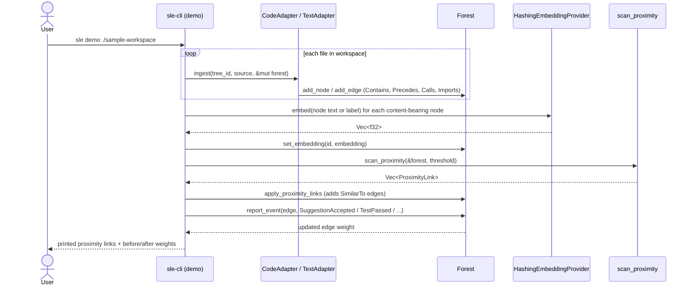
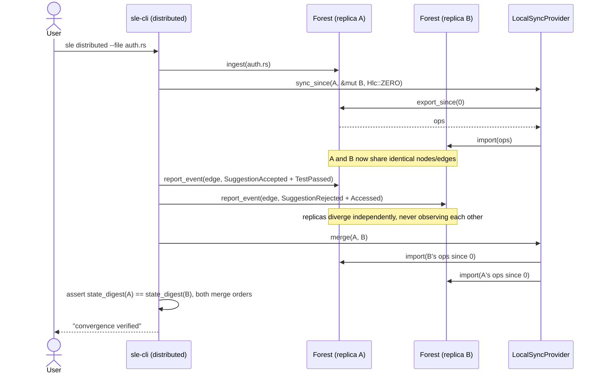
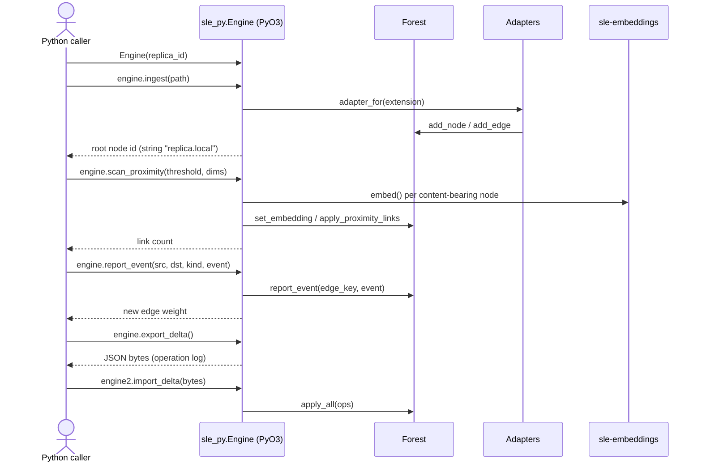

# Request / Data Flow

Sequence diagrams for the three entry points into the engine. Add a new
diagram here whenever a new entry point or user-facing flow is added (a new
CLI subcommand, a new bound Python method, a new adapter's ingest path
worth calling out separately).

## `sle-cli demo <path>` — ingest, embed, link, learn

## `sle-cli distributed --file <path>` — CRDT merge convergence

## Python bindings (`bindings/sle-py`) — same core, foreign-language caller

